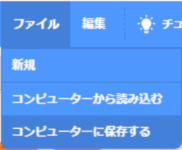
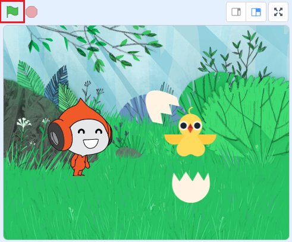
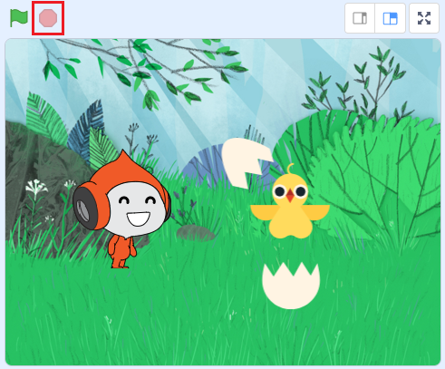

# 1.はじめに(Introduction)

このドキュメントでは、Scratch 3.0を使った『卵が孵化する』アニメーションの作成方法を説明します。

This document shows you how to create an "egg hatching" animation using Scratch 3.0.

ドキュメント作成者：望月 綾子(NTTテクノクロスサービス株式会社)

Document Author：Ayako Motizuki(NTT TechnoCrossService Corporation)、Takahiro Jincho(NTT TechnoCross Corporation)

# 2.準備：開発環境(Preparation:Development environment)

- [Scratch公式サイト(https://scratch.mit.edu/download)](https://scratch.mit.edu/download)から、Scratch 3.0をダウンロード、インストールします。(Scratch 3.0は、Windows、macOS、chromeOS、Androidに対応。(2020/04/13時点))

  Download and install Scratch 3.0 from the [Scratch official website(https://scratch.mit.edu/download)](https://scratch.mit.edu/download).(Scratch 3.0 is compatible with Windows, macOS, chromeOS, Android. (As of 2020/04/13))

# 3. 作り方(How to develop)

このゲームは、以下3つのプログラムで構成されています。

This game consists of the following three programs.

- 背景(Background)
- 卵(Egg)
- ピコ(Pico)

ここでは、各プログラムの作り方を説明します。
以下表のプログラム名をクリックすると、プログラムの説明が表示されます。
プログラムは 『**背景→卵→ピコ**』 の順番で作成します。

In this section, we will explain how to make each program.
Click on a program name in the table below to see a description of the program.
Programs are created in the order of "Background -> Egg -> Pico".

|プログラム名(Program name)|概要(Overview)|
|:----|:----|
|[背景(Background)](background.md)|背景のプログラムの説明(Background program description)|
|[卵(Egg)](egg.md)|卵のプログラムの説明(Egg's program description)|
|[ピコ(Pico)](pico.md)|ピコのプログラムの説明(Pico's program description)|

# 4.プログラムの保存方法(How to save the program)

Scrachのファイルのメニューから『コンピューターに保存する』を選択し、実行してください。

From the Scrach file menu, select "Save to computer" and run it.

# 5. プログラムの実行・停止方法(How to run and stop the program)

## 5-1. プログラムを実行(Run the program)

旗のボタンを押してください。

Press the flag button.

## 5-2. プログラムを停止(Stop the program)

赤いボタンを押してください。

Press the red button.

