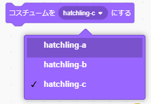

# 卵のプログラムの作り方

## 1.プログラムを作る前の準備(Preparation before develop the program)

- Scratch 3.0を起動し、スプライト1を削除してください。(スプライト1を選択→×をクリック)

  Start Scratch 3.0 and delete sprite 1.(Select sprite 1　→　Click ×)

-  ボタンをクリックしてください。

  Click on the   button.

- **Hatchlingを選択**、クリックしてください。

  Select a Hatchling and click on it.

- スプライトが設定されていることを確認してください。

- **大きさを『200』 に変更**してください。(数字をダブルクリックすることで、数字を編集できる状態になります。)

  Change the size to "200".(Double-clicking on a number, you will be able to edit the number.)

## 2. プログラムの作り方(How to develop a program)

### 2-1. 完成イメージ(Completed image)

### 2-2. 作り方(How to develop)

-  を押してください。

  Press  .

-  を押してください。

  Press  .

- 以下の画面が表示されるので、**『ブロック名』を『ブルブルの角度』に変更**してください。

  When the following screen appears, change the "Block Name" to "Angle of the Bulbul".

- 『引数を追加(数値またはテキスト)』をクリックし、**『number or text』を『角度』に変更**してください。

  Click on 'Add argument (number or text)' and change "number or text" to "angle".

- もう一度『引数を追加(数値またはテキスト)』をクリックし、**『number or text』を『タイマー』に変更**し、OKボタンを押してください。

  Click on 'Add argument (number or text)' again, change "number or text" to "timer" and press the OK button.

- 以下の画面が表示されることを確認してください。

  Confirm that the following screen is displayed.

- 以下のブロックを画面中央にドラッグ&ドロップします。

  Drag and drop the following blocks to the center of the screen.

   

   

-  の『90』に  をドラッグ&ドロップしてください。

  Drag and drop the  to the "90" of  .

-  の『1』に  をドラッグ&ドロップしてください。

  Drag and drop  to "1" of  .

- ブロックをくっつけてください。

  Connect the blocks.

-  を押してください。

  Press  .

-  を押してください。

  Press  .

- 以下の画面が表示されるので、**『ブロック名』を『ブルブル』に変更**してください。

  When the following screen appears, change the "Block Name" to "Bulbul".

- 『引数を追加(数値またはテキスト)』をクリックし、**『number or text』を『リスト番号』に変更**してください。

  Click 'Add argument (number or text)' and change 'number or text' to 'list number'.

-  を押してください。

  Press  .

-  を押してください。

  Press  .

- **『新しいリスト名：』に『角度』と入力後、『このスプライトのみ』を選択**してOKボタンを押してください。

  Enter "Angle" in the "New List Name:" field, select "This Sprite Only" and click the OK button.

- 空のリストが画面上に表示されることを確認してください。

  Confirm that the blank list display on the screen.

- リストの＋ボタンを押し、 **105、90、75、90、115、90、65、90、125、90、55、90** と計12項目設定してください。(1つ入力したら＋ボタンで項目を追加していってください。)

  Press the + button on the list and set a total of 12 items: 105, 90, 75, 90, 115, 90, 65, 90, 125, 90, 55, and 90. (Once you have entered one item, please add more items by pressing the + button.)

- 以下のブロックを画面中央にドラッグ&ドロップします。

  Drag and drop the following blocks to the center of the screen.

 

  ×3

  ×4

  ×4

-  の左側の○に  をドラッグ&ドロップし、右側の○にそれぞれ **1,2,3と入れて** ください。

    Drag and drop  into the left-hand circles of  , and put 1,2,3 into the right-hand circles, respectively.

 ,  , 

-  の左側の○に  をドラッグ&ドロップし、右側の○に **0.02と入れて** ください。

  Drag and drop  into the left circle of the  and put 0.02 into the right circle.

 ×4

-  の『1』の部分に  、  、  、  をドラッグ&ドロップしてください。

  Drag and drop  ,  ,  , and  into the "1" part of  .

 ,  ,  , 

- ブロックをくっつけてください。

  Connect the blocks.

- 以下のブロックを画面中央にドラッグ&ドロップします。

  Drag and drop the following blocks to the center of the screen.

   ×2

   ×2

 

 

   ×3

- 『コスチュームをhatchling-cにする』の▼ボタンを押し、表示される **コスチュームの一覧から『hatchling-a』を選んで** ください 。

  Press the ▼ button on "Make costume hatchling-c" and select "hatchling-a" from the list of costumes that will appear.

- 『メッセージ1を送る』のうち一つに対し、▼ボタンを押して **『新しいメッセージ』を選択して** ください。

  For one of the "Send Message 1" options, press the ▼ button and select "New Message".

- 以下の画面が表示されることを確認し、 **『新しいメッセージ名：』に『メッセージ2』と入力し** OKボタンを押してください。

  Enter "Message 2" in the "New Message Name:" field and click the OK button.

- 以下のブロックができます。

  You can create the following blocks.

- 『1秒待つ』の「1」を **『0.05』に変更** してください。(数字をダブルクリックすることで、数字を編集できる状態になります。)

  Change "1" in "1 second wait" to "0.05". (Double-click on the number to make it ready for editing.)

- 『ブルブルの角度○○』に **『90と1』** を入れてください。

  Put "90 and 1" in "Bulbul XX".

- 『ブルブル○』に、それぞれ **『1』『5』『9』** を入れてください。

  Put "1", "5", and "9" in the "Bulbul X", respectively.

 ,  , 

- ブロックをくっつけてください。

  Connect the blocks.

