# ピコのプログラムの作り方(How to develop a Pico program)

## 1. プログラムを作る前の準備(Preparation before develop the program)

-  ボタンをクリックしてください。

  Click on the  button.

- ピコ(Pico)を選択、クリックしてください。

  Select Pico and click on it.

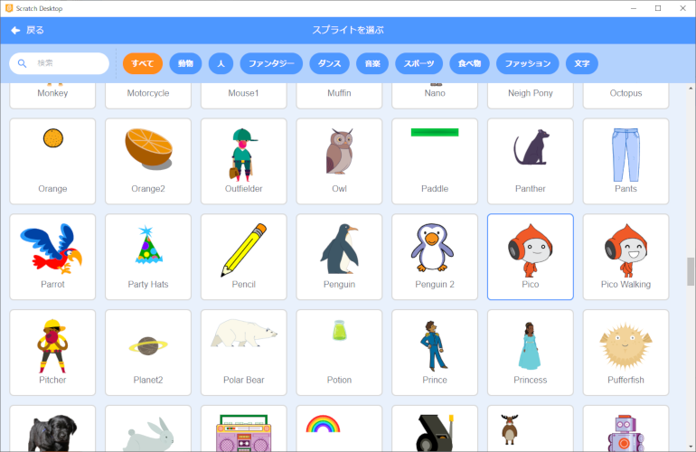

- スプライトが設定されていることを確認してください。

  Confirm that the selected sprite is set.

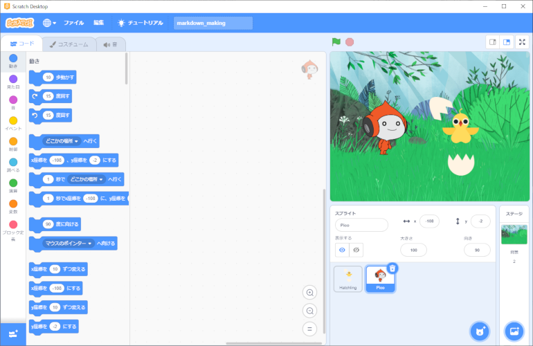

## 2. プログラムの作り方(How to develop a program)

### 2-1. 完成イメージ(Completed image)

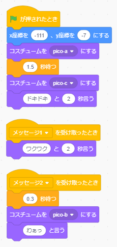

### 2-2. 作り方(How to develop)

- 以下のブロックを画面中央にドラック＆ドロップします。

  Drag and drop the following blocks to the center of the screen.

 

 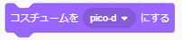 ×2 

 

 

- 『x座標を○、y座標を○にする』の **x座標に『-111』、y座標に『-7』と入れて**ください。(数字をダブルクリックすることで、数字を編集できる状態になります。)

  Enter "-111" in the x-coordinate and "-7" in the y-coordinate in "Make x-coordinate X and y-coordinate X". (Double-click on the number to make it ready for editing.)

- 『コスチュームをpico-dにする』の▼ボタンを押し、表示される **コスチュームの一覧から、それぞれ『pico-a』、『pico-c』を選んで**ください 。

  Press the ▼ button on "Make costume pico-d" and select "pico-a" or "pico-c" from the list of costumes that will appear.

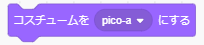 , 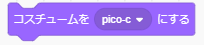

- 『こんにちは！と2秒言う』「こんにちは！」を **『ドキドキ』に変更**してください。(文字をダブルクリックすることで、文字を編集できる状態になります。)

  "Hello! Two seconds to say, "Hello! should be changed to "Doki-Doki". (Double-click on a character to make it ready to be edited.)

- 『1秒待つ』の「1」を **『1.5』に変更**してください。(数字をダブルクリックすることで、数字を編集できる状態になります。)

  Change "1" in "Wait 1 second" to "1.5". (Double-click on the number to make it ready for editing.)

- ブロックをくっつけてください。

  Connect the blocks.

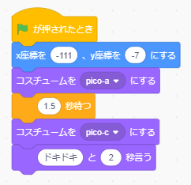

・以下のブロックを画面中央にドラッグ&ドロップします。

  Drag and drop the following blocks to the center of the screen.

 

 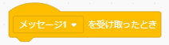

- 『こんにちは！と2秒言う』「こんにちは！」を **『ワクワク』に変更**してください。(文字をダブルクリックすることで、文字を編集できる状態になります。)

  "Hello! Two seconds to say, "Hello! should be changed to "Exciting". (Double-click on a character to make it ready to be edited.)

・ブロックをくっつけてください。

  Connect the blocks.

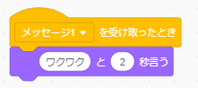

- 以下のブロックを画面中央にドラッグ&ドロップします。

  Drag and drop the following blocks to the center of the screen.

  

 

 

- 『こんにちは！と言う』の「こんにちは！」を **『わぁっ』に変更**してください。(文字をダブルクリックすることで、文字を編集できる状態になります。)

  "Hello! The "hello!" in "say should be changed to "Wow". (Double-click on a character to make it ready to be edited.)

- 『コスチュームをpico-dにする』の▼ボタンを押し、表示される **コスチュームの一覧から『pico-b』を選んで**ください 。

  Press the ▼ button on "Make costume pico-d" and select "pico-b" from the list of costumes that appears.

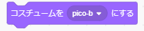

- 『メッセージ1を受け取ったとき』の▼ボタンを押し、表示される **一覧から『メッセージ2』を選んで**ください。

  Press the ▼ button on "When you received message 1" and select "Message 2" from the list that appears.

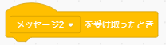

- 『1秒待つ』の「1」を **『0.3』に変更**してください。(数字をダブルクリックすることで、数字を編集できる状態になります。)

  Change "1" in "Wait 1 second" to "0.3". (Double-click on the number to make it ready for editing.)

- ブロックをくっつけてください。

  Connect the blocks.

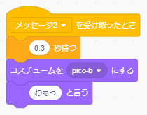

